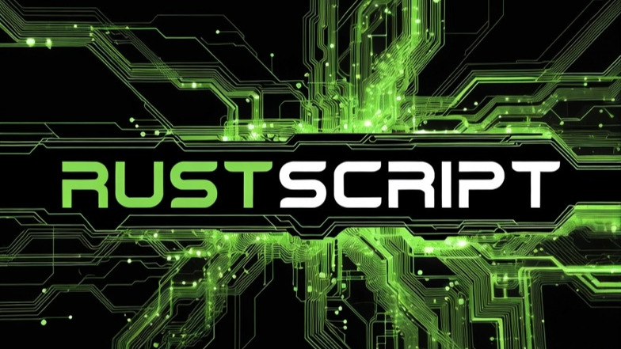

<p align="center">

</p>

# RustScript

**Author**: Michael Lauzon

RustScript is a modern scripting language that synthesises the best ideas from 60+ years of scripting language evolution. Starting with Rust's memory safety and JavaScript's ergonomic syntax as a foundation, RustScript incorporates powerful features from scripting languages spanning LISP (1958) to Zig (2016).

## Language Heritage

RustScript draws inspiration from one systems programming language and over 20 scripting languages across computing history:

**Memory Safety**: Rust (systems programming language)  
**Type Systems**: ML, Haskell, TypeScript, Eiffel  
**Expressiveness**: Python, Ruby, JavaScript, Kotlin, Swift, Rebol  
**Functional Programming**: LISP, Scheme, Haskell, F#, Scala, Clojure  
**Pattern Matching**: Erlang, Elixir, ML, OCaml  
**Metaprogramming**: LISP, Zig, D, Nim  
**Multiple Dispatch**: Julia, Common Lisp (CLOS), Dylan  
**Effects & Contracts**: Eiffel, Koka, Ada, D  
**Data Processing**: APL, AWK, Icon, SNOBOL, MUMPS  
**Stack-Based**: Forth  
**Modern Features**: C#, TypeScript, Swift, Kotlin  

## Design Philosophy

RustScript addresses a fundamental tension in modern software development: the trade-off between safety and productivity. Rather than forcing a choice between Rust's safety and JavaScript's ease of use, RustScript provides the best of both worlds—plus features from dozens of other scripting languages that solved specific problems elegantly.

### Core Principles

1.  **Gradual Safety** (from TypeScript, Kotlin): Types are optional during prototyping but can be added incrementally. Immutability is the default (from Rust, Clojure), catching entire classes of bugs without requiring explicit type annotations everywhere.

2.  **Expression-Oriented Design** (from Rust, Scala, ML): Following Rust's lead, nearly everything is an expression. This eliminates temporary variables and explicit return statements, resulting in more concise, functional code.

3.  **Composition Over Inheritance** (from Rust, Go): RustScript uses Rust's `struct` + `impl` model rather than class-based inheritance. This separation of data and behaviour encourages better architectural decisions and makes code easier to reason about.

4.  **Explicit Error Handling** (from Rust, Haskell): Rather than exceptions that create invisible control flow, RustScript uses `Result` types. Failure modes are explicit in function signatures, forcing deliberate error handling decisions.

5.  **Learn from History**: Every feature in RustScript has been proven in production across multiple languages. We don't reinvent the wheel—we use the best wheels ever made.

## Installation

### Building from Source

RustScript requires Rust 1.91.1 or later with Edition 2024 support.

```bash
git clone https://github.com/RustScript2025/RustScript.git
cd RustScript
cargo build --release
```

The compiler binary will be located at `target/release/rjsc` (or `target/release/rjsc.exe` on Windows).

**Note**: RustScript is built using Rust Edition 2024, taking advantage of the latest language features including implicit format arguments, improved error handling, and modern idioms.

### System Requirements

- Rust 1.91.1+ with cargo (Edition 2024 support)
- For WebAssembly builds: wasm-pack (`cargo install wasm-pack`)
- For browser testing: Python 3.x (for the development server)

## Browser Runtime

RustScript programmes can execute directly in web browsers via WebAssembly:

1. Build the WASM package: `wasm-pack build --target web --out-dir www/pkg`
2. Start the development server: `python serve.py`
3. Open `http://localhost:8000` in your browser

The runtime automatically compiles and executes `<script type="text/rustscript">` tags, similar to how browsers handle JavaScript.

## Usage

Compile a RustScript file (`.rjsc`) to JavaScript or WASM:

```bash
# Compile to JavaScript (default)
./target/release/rjsc input.rjsc

# Compile to WebAssembly
./target/release/rjsc input.rjsc --target wasm
```

## Learning RustScript

**New to RustScript?** Start with our comprehensive tutorial:

📚 **[Complete Tutorial](docs/TUTORIAL.md)** - Learn RustScript from Hello World to advanced features

The tutorial covers:
- Getting started and your first programme
- Variables, functions, and control flow
- Data structures and pattern matching
- All Phase 1, 2, and 3 features with detailed explanations
- Real-world application examples

## Language Guide & Examples

### 1. Variables and Types

RustScript uses `let` for immutable variables and `let mut` for mutable ones.

**Rationale**: JavaScript's `let` is mutable by default, requiring `const` for immutability. RustScript inverts this: `let` creates immutable bindings, whilst `let mut` explicitly opts into mutation. This design makes state changes visible and deliberate, reducing an entire category of bugs related to unexpected mutations.

```rustscript
// Immutable by default
// Attempting to reassign 'name' later would be a compile error.
let name = "Alice";

// Mutable variable
// We explicitly opt-in to mutation.
let mut count: i32 = 0;
count += 1;

// Constants
// Compile-time constants, similar to Rust's const.
const MAX_USERS = 100;
```

### 2. Functions

Functions are expression-oriented.

**Rationale**: Implicit returns (the final expression in a block) encourage thinking about functions as data transformations rather than imperative procedures. Named arguments eliminate the "mystery boolean" problem where call sites like `greet("Bob", true)` are opaque compared to `greet(name: "Bob", formal: true)`.

```rustscript
fn add(a: i32, b: i32) -> i32 {
    a + b // Implicit return, no semicolon needed
}

// Named arguments supported
fn greet(name: string, formal: bool) {
    if formal {
        console.log("Good day, " + name);
    } else {
        console.log("Hi " + name);
    }
}

// Clearer call site
greet(name: "Bob", formal: false);
```

### 3. Structs and Objects

We use `struct` for data and `impl` for behaviour.

**Rationale**: Class-based inheritance often leads to deep hierarchies and tight coupling between state and behaviour. Structs are pure data structures. Methods are functions that operate on that data. This separation is fundamental to RustScript's design, promoting composition and making data flow explicit.

```rustscript
struct User {
    username: string,
    email: string,
    active: bool
}

impl User {
    // Static method (constructor convention)
    fn new(name: string) -> User {
        User {
            username: name,
            email: "",
            active: true
        }
    }

    // Method taking mutable reference to self
    fn deactivate(&mut this) {
        this.active = false;
    }
}
```

### 4. Pattern Matching

Powerful pattern matching for control flow.

**Rationale**: JavaScript's `switch` statements are error-prone due to implicit fallthrough and lack of exhaustiveness checking. Match expressions require handling all cases and support destructuring, eliminating an entire category of "unhandled state" bugs at compile time.

```rustscript
fn get_status_message(status: i32) -> string {
    match status {
        200 => "OK",
        404 => "Not Found",
        500..=599 => "Server Error", // Range matching
        _ => "Unknown Status"        // Catch-all
    }
}
```

### 5. Error Handling

RustScript uses `Result` and `Option` types.

**Rationale**: Exceptions create invisible control flow that can jump across arbitrary stack frames. `Result<T, E>` treats errors as first-class values that can be passed, transformed, and handled explicitly. Whilst `try/catch` remains available for JavaScript interoperability, idiomatic RustScript code uses `Result` types.

```rustscript
fn divide(a: f64, b: f64) -> Result<f64, string> {
    if b == 0.0 {
        Err("Division by zero")
    } else {
        Ok(a / b)
    }
}

// Usage
match divide(10.0, 2.0) {
    Ok(val) => console.log("Result: " + val),
    Err(msg) => console.error("Error: " + msg)
}
```

### 6. Advanced Features

RustScript includes modern features like the pipeline operator (`|>`), `defer`, and `guard`.

**Rationale**:
- **Pipeline (`|>`)**: Deeply nested function calls like `a(b(c(data)))` require reading inside-out. Pipelines `data |> c |> b |> a` follow natural left-to-right data flow, improving readability.
- **Guard**: Early returns for error conditions reduce nesting (the "arrow code" problem), making the happy path more prominent.
- **Defer**: Guarantees cleanup code executes regardless of how a function exits (return, error, etc.), preventing resource leaks without try-finally blocks.

```rustscript
// Pipeline operator
let result = data
    |> process
    |> validate
    |> save;

// Guard clause
fn process_email(email: string) {
    // If condition is false, execute the block (usually returns)
    guard email.contains("@") else {
        console.error("Invalid email");
        return;
    }
    
    // Defer execution until end of scope
    defer {
        console.log("Finished processing");
    }

    // ... proceed with valid email
}
```

## Scripting Language Features & Their Origins

RustScript's feature set represents a curated selection from scripting language history:

### From the 1950s-1960s
- **LISP (1958)**: First-class functions, REPL, homoiconicity
- **APL (1966)**: Array-oriented operations
- **MUMPS (1966)**: Persistent data structures

### From the 1970s
- **ML (1973)**: Type inference, algebraic data types
- **Scheme (1975)**: Lexical scoping, tail call optimisation
- **Forth (1970)**: Stack-based operations, concatenative programming
- **AWK (1977)**: Pattern-action paradigm, implicit iteration
- **Icon (1977)**: Generators, goal-directed evaluation

### From the 1980s
- **Eiffel (1986)**: Design by Contract (requires/ensures/invariant)
- **Erlang (1986)**: Pattern matching in function heads, actor model

### From the 1990s
- **Python (1991)**: List comprehensions, generators, clean syntax
- **Ruby (1995)**: String interpolation, blocks, method chaining
- **Rebol (1997)**: Dialects, minimal syntax

### From the 2000s
- **C# (2000)**: Null coalescing operator, LINQ
- **Scala (2004)**: Hybrid functional/OOP, pattern matching
- **F# (2005)**: Computation expressions, type providers
- **Clojure (2007)**: Immutable data structures, persistent collections

### From the 2010s
- **Julia (2012)**: Multiple dispatch, performance
- **TypeScript (2012)**: Gradual typing, structural types
- **Kotlin (2011)**: Null safety, extension functions
- **Swift (2014)**: Optional chaining, protocol extensions
- **Zig (2016)**: Compile-time execution (comptime)
- **Nim (2008)**: Effect system, metaprogramming

## Contributing

Interested in contributing to RustScript? We'd love your help!

👉 **[Read the Contributing Guide](CONTRIBUTING.md)** for:
- Development setup and workflow
- Code style guidelines (Rust Edition 2024)
- How to add new features
- Testing and documentation standards
- Pull request process

## Compiler Implementation

The RustScript compiler is built with modern Rust practices:

- **Edition 2024**: Uses the latest Rust edition with implicit format arguments and modern idioms
- **Type Safety**: Comprehensive type checking with inference
- **Borrow Checking**: Memory safety without garbage collection
- **Error Handling**: Detailed diagnostics with source context and colour output
- **WebAssembly**: Direct compilation to WASM for browser execution
- **Modular Architecture**: Clean separation between lexer, parser, type checker, and code generator

### Compiler Pipeline

1. **Lexing**: Tokenises source code using the `logos` crate
2. **Parsing**: Builds AST using the Pest parser generator
3. **Type Checking**: Infers and validates types throughout the programme
4. **Borrow Checking**: Ensures memory safety and ownership rules
5. **Code Generation**: Produces JavaScript or WebAssembly output
6. **Source Maps**: Generates source maps for debugging

## License

This project is licensed under the GPL-2.0 License.


## Phase 1 Features (NEW!)

RustScript now includes modern syntax enhancements inspired by the best scripting languages:

### String Interpolation
```rust
let name = "Alice";
let greeting = "Hello, {name}! Welcome to RustScript.";
```

### Optional Chaining
```rust
let street = user?.address?.street;  // Safe navigation
```

### Null Coalescing
```rust
let name = user_name ?? "Anonymous";  // Default values
```

### List Comprehensions
```rust
let evens = [x * 2 for x in numbers if x % 2 == 0];
```

See [Phase 1 Features Documentation](docs/PHASE1_FEATURES.md) for complete details and examples.


## Phase 2 Features (NEW!)

Advanced function capabilities inspired by the best functional languages:

### Pattern Matching in Function Heads
```rust
fn factorial(0) -> number { 1 }
fn factorial(n) -> number { n * factorial(n - 1) }
```

### Generators
```rust
gen fn fibonacci() {
    let (a, b) = (0, 1);
    loop {
        yield a;
        (a, b) = (b, a + b);
    }
}
```

### Multiple Dispatch
```rust
fn process(x: number, y: number) -> string { "Adding: {x + y}" }
fn process(x: string, y: string) -> string { "Concat: {x}{y}" }
```

See [Phase 2 Features Documentation](docs/PHASE2_FEATURES.md) for complete details and examples.


## Phase 3 Features (NEW!)

Safety and metaprogramming inspired by Eiffel, Zig, and modern effect systems:

### Design by Contract
```rust
fn divide(a: number, b: number) -> number
    requires b != 0, "Divisor cannot be zero"
    ensures result * b ≈ a
{
    a / b
}
```

### Effect System
```rust
effect [pure]
fn add(a: number, b: number) -> number { a + b }

effect [io, throws]
fn read_file(path: string) -> string { ... }
```

### Compile-time Execution
```rust
comptime {
    const BUFFER_SIZE = 1024;
    const FIB_10 = fibonacci(10);  // Computed at compile time
}
```

See [Phase 3 Features Documentation](docs/PHASE3_FEATURES.md) for complete details.

## All Features Summary

RustScript now includes **10 major features** across 3 phases:

**Phase 1 - Syntax:** String interpolation, Optional chaining, Null coalescing, List comprehensions  
**Phase 2 - Functions:** Pattern matching, Generators, Multiple dispatch  
**Phase 3 - Safety:** Design by Contract, Effect system, Compile-time execution

Drawing inspiration from 60+ years of programming language evolution, from LISP (1958) to Zig (2016).


## Feature Attribution

Each RustScript feature has a rich scripting language heritage:

### Phase 1: String & Syntax Enhancements

**String Interpolation** (`"Hello, {name}!"`)
- Inspired by: Ruby (1995), Python (2015), Kotlin (2011), JavaScript ES6 (2015)
- Why: Eliminates error-prone string concatenation

**Optional Chaining** (`user?.address?.street`)
- Inspired by: Swift (2014), TypeScript (2020), C# (2015)
- Why: Safe navigation through potentially null values

**Null Coalescing** (`value ?? "default"`)
- Inspired by: C# (2000), Swift (2014), PHP (2009), JavaScript (2020)
- Why: Concise default value handling

**List Comprehensions** (`[x * 2 for x in numbers if x > 0]`)
- Inspired by: Python (1994), Haskell (1990), Scala (2004), F# (2005)
- Why: Declarative collection transformation

### Phase 2: Function Enhancements

**Pattern Matching in Function Heads** (Multiple definitions)
- Inspired by: Erlang (1986), Elixir (2011), Haskell (1990), ML (1973)
- Why: Elegant handling of different input cases

**Generators** (`gen fn name() { yield value; }`)
- Inspired by: Python (2001), JavaScript ES6 (2015), C# (2005), Icon (1977)
- Why: Memory-efficient lazy evaluation

**Multiple Dispatch** (Type-based function selection)
- Inspired by: Julia (2012), Common Lisp CLOS (1988), Dylan (1992), Clojure (2009)
- Why: Symmetric treatment of all arguments

### Phase 3: Safety & Contracts

**Design by Contract** (`requires`/`ensures`/`invariant`)
- Inspired by: Eiffel (1986), D (2001), Ada (1983), Spec# (2004)
- Why: Formal specification of function behaviour

**Effect System** (`effect [pure, io, state, ...]`)
- Inspired by: Koka (2012), Eff (2012), Nim (2008), Rust traits
- Why: Track and control side effects

**Compile-time Execution** (`comptime { ... }`)
- Inspired by: Zig (2016), D CTFE (2007), C++ constexpr (2011), Nim (2008)
- Why: Move computation from runtime to compile time

## Why These Features?

Each feature was chosen because it solved a real problem elegantly in its original scripting language:

1. **String Interpolation**: Ruby showed that embedded expressions are more readable than concatenation
2. **Optional Chaining**: Swift proved that safe navigation prevents entire categories of null pointer errors
3. **Null Coalescing**: C# demonstrated that default values shouldn't require verbose if-else chains
4. **List Comprehensions**: Python showed that transforming collections should read like mathematics
5. **Pattern Matching**: Erlang proved that multiple function definitions are clearer than nested if-else
6. **Generators**: Python demonstrated that lazy evaluation enables infinite sequences with finite memory
7. **Multiple Dispatch**: Julia showed that mathematical operations should work symmetrically on all types
8. **Design by Contract**: Eiffel proved that formal specifications catch bugs that tests miss
9. **Effect System**: Koka demonstrated that tracking side effects makes code easier to reason about
10. **Compile-time Execution**: Zig showed that moving work to compile time improves both safety and performance

## Standing on the Shoulders of Giants

RustScript doesn't claim to invent new concepts. Instead, it carefully selects and integrates the best ideas from decades of scripting language research and practice. Every feature has been battle-tested in production systems across multiple scripting languages.

By learning from scripting language history, RustScript avoids repeating past mistakes whilst embracing proven solutions. The result is a scripting language that feels familiar to developers from many backgrounds whilst offering a cohesive, modern development experience.

## Further Reading

- 📚 [Tutorial](docs/TUTORIAL.md) - Complete guide from Hello World to advanced features
- ⚡ [Quick Reference](docs/QUICK_REFERENCE.md) - Concise syntax reference
- 📖 [Phase 1 Features](docs/PHASE1_FEATURES.md) - String & syntax enhancements
- 📖 [Phase 2 Features](docs/PHASE2_FEATURES.md) - Function enhancements
- 📖 [Phase 3 Features](docs/PHASE3_FEATURES.md) - Safety & metaprogramming
- 💻 [Examples Directory](examples/) - Working code examples ([see examples README](examples/README.md))
- 🤝 [Contributing Guide](CONTRIBUTING.md) - How to contribute to RustScript


